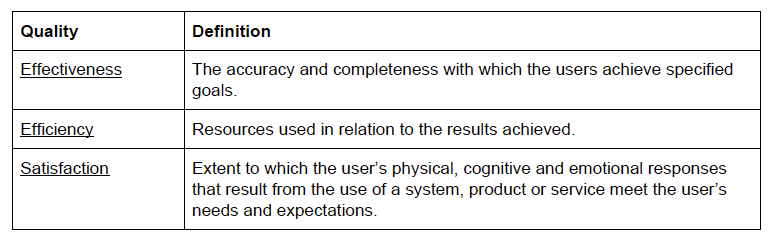
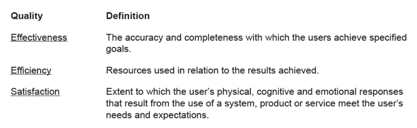

# Free the Text from Behind Bars

Tables are most of the times more elegant without the bars that *"imprison"* the content.
In fact, very often the bars are not doing anything more than just distracting from the content. 

e.g. A table showing the sub-qualities of usability "imprisoned" behind gridlines :

and the same table without lines. Nothing is lost. In fact, the content stands out better now.

This is an instance of [maximizing the data-ink ratio](https://infovis-wiki.net/wiki/Data-Ink_Ratio) -- one of the most memorable advices of Edward Tufte from his book The Visual Display of Quantitative Data. 