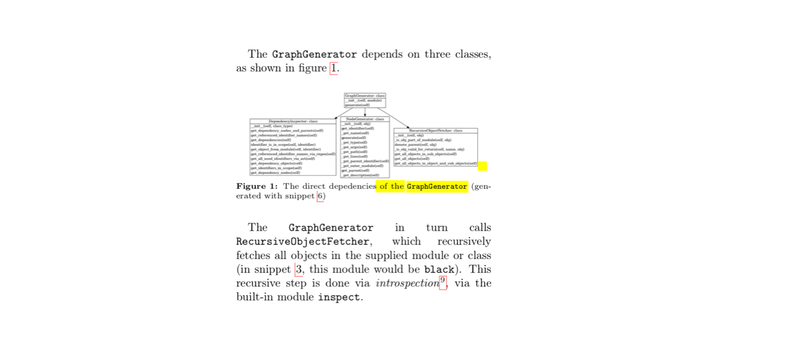

# Use Right Font Size in Images

Font size in images should be comparable with the rest of the text in the document.

The image below is bad because the font in the diagram is much smaller than the font in the surrounding text: 

Just as annoying can be the text in a figure that is much larger than the surrounding text.

