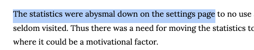

# Avoid Adjectives

Is *abysmal* really needed in the previous example? 
Do you want to get into a debate with the reader whether the positioning of the settings was just down on the page or *abysmally* down? I don't think so. 

Adjectives are usually your opinions or judgements. Use them sparingly if at all. 
In a scientific text you should keep opinions for the *Discussion* section. 

Everywhere else, stick to facts.

